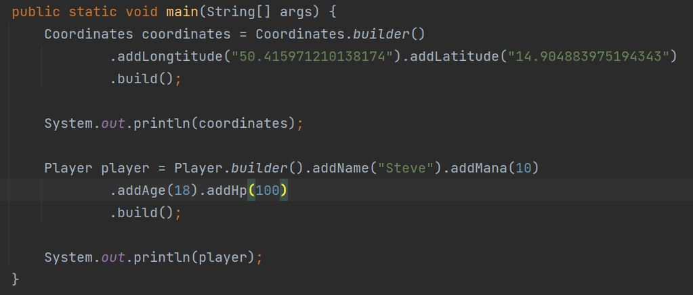

## Java Builder

- Vytovřte základní builder pro Coordinates s atributy $longtitude$ a $latitude$. Následně vztvořte novou instanci Coordinates s použitím nově implementovaného Builderu.

- Vytvořte třídu Player.
- Tato třída bude obsahovat atributy name, age, spritePath, hp, mana a xp.
Instance třídy se bude vytvářet v tomto formátu:
Player player = new Player.PlayerBuilder().setName("Steve").setMana(200).build();

- Upravte Builder tak aby artibuty *name* a *mana* byly povinné a instance se nedala vytvořit bez zadání těchto hodnot.

